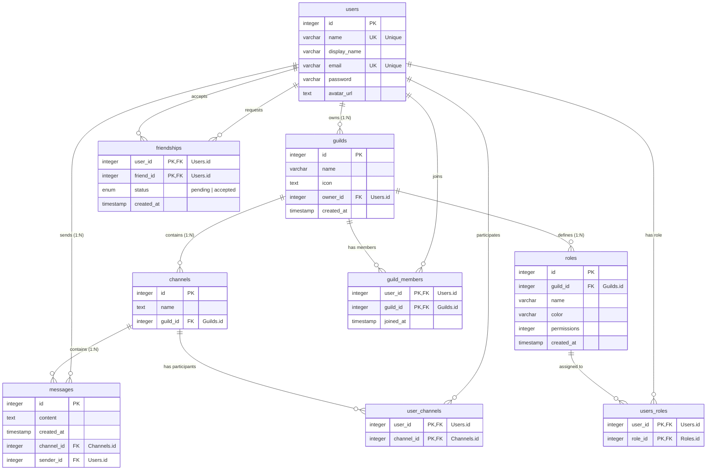

*このプロジェクトは 42 のカリキュラムの一環として、smatsuo, kakawamo, hirosuzu, tkitahar によって作成されました。*

# Description

ft_transcendenceは、42のカリキュラムの最終プロジェクトとして作成されたWebアプリケーションです。
このプロジェクトの主な目的は、複数ユーザーが同時にアクセスできるWebアプリケーションを構築することです。

## 主な機能
- **チャット機能**: ギルドやDMを通じて他のユーザーとリアルタイムで会話できます。
- **ユーザープロフィール**: アバターやニックネームなどが表示されます。
- **3Dモデル生成**: Meshyを使用して3Dモデルを生成し、他のユーザーに送信できます。

# Instructions

## 前提条件
以下のツールがインストールされている必要があります。
- Docker Compose

## 環境構築と実行方法

1. リポジトリをクローンします:
```bash
git clone <url> --recursive
```

2. サブモジュールを更新します:
```bash
git submodule update --init --recursive
```

3. `.env.example`をコピーして、`.env`に必須の環境変数を設定します。

4. (optional) `/etc/hosts`を書き換えて、`WEBAPP_HOST`, `STORAGE_HOST`, `KIBANA_HOST` で指定したドメインと `127.0.0.1` をバインドします:
```bash
127.0.0.1   <WEBAPP_HOSTで指定したhostname> <STORAGE_HOSTで指定したhostname> <KIBANA_HOSTで指定したhostname>
```

5. アプリケーションを実行します:

開発用:
```bash
docker compose up
```

本番用:
```bash
docker compose -f compose.prod.yml up
```

6. サービスへのアクセス:

| サービス | 開発環境URL | 本番環境URL |
| --- | --- | --- |
| Web Application | http://localhost:5173 | `https://${HOST}` |
| MinIO Console | http://localhost:9001 | `https://${HOST}:${STORAGE_PORT}` |
| Kibana | http://localhost:5601 | `https://${HOST}:${KIBANA_PORT}` |

Kibanaへのログイン:
- Username: `elastic`
- Password: `.env`ファイルの`ELASTIC_PASSWORD`で設定した値

# Resources

このプロジェクトの開発には、以下の公式ドキュメントや記事を参考にしました。

## 参考文献
- [React Router v7 Documentation](https://reactrouter.com/)
- [Mantine UI Documentation](https://mantine.dev/)
- [Drizzle ORM Documentation](https://orm.drizzle.team/)
- [Tailwind CSS v4 Documentation](https://tailwindcss.com/)
- [Hono Documentation](https://hono.dev/)

## AIの活用について
開発プロセスにおいて、コードの生成、デバッグ、リファクタリング、およびドキュメント作成の補助として、GitHub CopilotおよびGeminiを使用しました。特に、複雑なコンポーネントの初期実装やエラー解決の迅速化に活用されました。

# Team Information

| メンバー | 役割 (Role) | 担当 (Responsibilities) |
| --- | --- | --- |
| smatsuo | Tech Lead | 技術選定 / 設計 / レビュー / 機能開発 |
| kakawamo | Developer | 機能開発 |
| hirosuzu | PO | 要件定義 / 3Dモデリング / UIデザイン |
| tkitahar | PM | プロジェクト管理 / 法務 |

# Project Management

## 開発フロー
GitHub IssuesとProjectsを使用してタスクを管理しました。具体的なフローは以下の通りです。

1. **Issue作成**: バックログにイシューを追加。
2. **要件定義**: PO, PM, テックリードとすり合わせを行い、Planningへ移動。
3. **設計**: UIイメージや実装方針をIssueに記載。
4. **実装**: 実装担当者を決定し、In progressへ。
5. **レビュー**: PRを作成し、コードレビューを実施（Copilotレビュー -> チームレビュー）。
6. **マージ**: 承認後、mainブランチへマージ。

## 使用ツール
- **タスク管理**: GitHub Projects / Issues
- **コミュニケーション**: Discord

# Technical Stack

## Frontend
- **Framework**: React Router v7
- **Library**: React 19
- **UI Framework**: Mantine UI, Tailwind CSS

## Backend
- **Runtime**: Bun
- **Framework**: Hono (via react-router-hono-server)
- **ORM**: Drizzle ORM
- **Inmemory DB**: Redis

## Database
- **PostgreSQL**: 高性能かつ拡張性が高いOSSであるため

## Infrastructure & DevOps
- **Containerization**: Docker, Docker Compose
- **Object Storage**: MinIO
- **Logging/Monitoring**: Elastic Stack (Elasticsearch, Logstash, Kibana)
- **Linting/Formatting**: Biome

## 技術選定の理由 (Justification)
- **React Router v7**: バックエンドとフロントエンド間をシームレスに統合するため
- **Mantine UI**: 高品質でアクセシブルなコンポーネントにより開発効率を向上させるため。
- **Drizzle ORM**: 型安全性とSQLライクな操作性を両立し、パフォーマンスも優れているため。
- **Bun**: 高速なランタイムと豊富なAPIにより、開発体験と実行パフォーマンスを向上させるため。

# Database Schema

データベーススキーマの詳細は、コードベースの `db/schema` ディレクトリを参照してください。
主なテーブル構造は以下の通りです：

- **users**: ユーザー情報管理
- **user_channels**: ユーザーとチャンネルの関連付け
- **messages**: チャットメッセージ



# Features List

1. **User Profile (ユーザープロフィール)**
   - ユーザー情報の表示・編集
   - アバター画像アップロード (MinIO使用)

2. **Chat (チャット)**
   - リアルタイムDM (Direct Message)
   - チャンネル作成・管理 
   - ユーザー招待・ブロック機能

3. **Friend System (友達システム)**
   - ユーザーの友達追加・削除
   - ユーザーの友達一覧表示

# Modules
合計獲得ポイント: **19** (Major: 8 * 2pts, Minor: 3 * 1pt)

## Major Modules (2pts each)

### Use a framework for both the frontend and backend.
- **Points**: 2pts
- **Justification**: モダンなWeb開発のベストプラクティスを学び、開発効率と保守性を高めるため。堅牢でスケーラブルなアプリケーション構築に不可欠と判断しました。
- **Implementation**: フロントエンドには **React Router v7**、バックエンドには **Hono** を採用しました。これらはTypeScriptによる型安全性と高いパフォーマンスを提供します。
- **Members**: smatsuo

### Implement real-time features using WebSockets or similar technology.
- **Points**: 2pts
- **Justification**: チャットやゲームプレイにおいて、ユーザー間の遅延のない即時対話を実現し、UXを向上させるため。
- **Implementation**: WebSocketプロトコルを使用し、サーバー側はHonoのWebSocketヘルパー、クライアント側はReact hooksを用いてリアルタイム通信を実装しました。
- **Members**: smatsuo

### Allow users to interact with other users.
- **Points**: 2pts
- **Justification**: ソーシャルプラットフォームとしての基本的な価値を提供し、ユーザーエンゲージメントを高めるため。
- **Implementation**: フレンド申請・承認フロー、ブロック機能、およびユーザーステータス（オンライン/オフライン/ゲーム中）の表示機能を実装しました。
- **Members**: smatsuo, kakawamo

### Standard user management and authentication.
- **Points**: 2pts
- **Justification**: リッチなチャット体験を提供するため
- **Implementation**: Websocketを使用してタブが開いている間は接続をキープすることで、オンラインかどうかを判定する機能を実装しました。また、アバターはMinIOを使用して保存し、画像を表示する機能を実装しました。
- **Members**: smatsuo

### Advanced permissions system.
- **Points**: 2pts
- **Justification**: チャンネルや組織内での役割に応じた適切なアクセス制御（セキュリティ）を行うため。
- **Implementation**: ロールベースアクセス制御 (RBAC) を導入し、Administrator, Member, Owner などの権限レベルに応じてAPIエンドポイントやUIコンポーネントの操作を制限しています。
- **Members**: kakawamo

### An organization system.
- **Points**: 2pts
- **Justification**: コミュニティ形成を促進し、グループ単位での活動や競争を可能にするため。
- **Implementation**: 「ギルド」システムとして実装しました。ユーザーは組織を作成・参加でき、組織内専用のチャット等の機能を利用できます。
- **Members**: kakawamo

### Implement advanced 3D graphics using a library like Three.js or Babylon.js.
- **Points**: 2pts
- **Justification**: 視覚的にリッチな体験を提供し、通常のWebアプリケーションの制約を超えた表現を行うため。
- **Implementation**: **Three.js** (React Three Fiber) を使用し、Webブラウザ上で3Dモデルのレンダリングとインタラクションを実現しました。Meshy APIで生成したモデルの表示にも対応しています。
- **Members**: hirosuzu

### Infrastructure for log management using ELK (Elasticsearch, Logstash, Kibana).
- **Points**: 2pts
- **Justification**: 本番環境相当のログ管理基盤を構築し、トラブルシューティングと利用状況の分析を容易にするため。
- **Implementation**: DockerコンテナとしてElasticsearch, Logstash, Kibanaを立ち上げ、アプリケーションログをLogstash経由で収集・インデックス化し、Kibanaダッシュボードで可視化するパイプラインを構築しました。
- **Members**: smatsuo

## Minor Modules (1pt each)

### Use an ORM for the database.
- **Points**: 1pt
- **Justification**: 生のSQLを書くことによるエラーやセキュリティリスク（インジェクション攻撃）を防ぎ、開発効率を向上させるため。
- **Implementation**: **Drizzle ORM** を使用して型安全なスキーマ定義とクエリ構築を行っています。
- **Members**: smatsuo

### Server-Side Rendering (SSR) for improved performance and SEO.
- **Points**: 1pt
- **Justification**: 初期表示速度（FCP）の改善しUXを向上刺せるため
- **Implementation**: React Router v7のSSR機能を活用し、サーバー側でHTMLをプリレンダリングしてクライアントに配信しています。
- **Members**: smatsuo

### Support for additional browsers.
- **Points**: 1pt
- **Justification**: 特定のブラウザに依存せず、より多くのユーザーが快適に利用できる環境を提供するため。
- **Implementation**: 標準的なWeb技術に準拠した実装を行い、Chromeに加え、FirefoxやSafariなどの主要ブラウザでの動作検証と互換性確保を行いました。
- **Members**: smatsuo


# Individual Contributions

各メンバーの役割と具体的な貢献は以下の通りです。

## smatsuo (Tech Lead)
- **役割**: 技術選定、アーキテクチャ設計、コードレビュー、主要機能の実装
- **担当モジュール**:
  - **Framework**: React Router v7 (Frontend) と Hono (Backend) の導入・基盤構築
  - **Real-time features**: WebSocketを使用したリアルタイム通信の実装
  - **User Management**: オンライン判定機能、MinIOを使用したアバター画像の保存・表示機能、認証周りの実装
  - **Infrastructure**: ELKスタックによるログ管理基盤の構築
  - **Database**: Drizzle ORMの導入とスキーマ管理
  - **Web**: SSRの実装、クロスブラウザ対応など
  - **Interaction**: フレンド機能、ブロック機能などのユーザー間インタラクションの実装（kakawamoと共同）

## kakawamo (Developer)
- **役割**: バックエンドおよびフロントエンドの機能開発
- **担当モジュール**:
  - **Permissions**: ロールベースアクセス制御 (RBAC) の実装
  - **Organization**: ギルドシステムの設計と実装
  - **Interaction**: ユーザー間インタラクション機能の実装（smatsuoと共同）

## hirosuzu (PO)
- **役割**: プロダクトオーナー、要件定義、UI/UXデザイン、3D機能実装
- **担当モジュール**:
  - **Graphics**: Three.jsとMeshy APIを用いた3Dモデル生成・表示機能の実装
  - **Design**: アプリケーション全体のUIデザインとユーザー体験の設計

## tkitahar (PM)
- **役割**: プロジェクトマネージャー、進行管理、法務対応
- **担当モジュール・タスク**:
  - **Legal**: 利用規約およびプライバシーポリシーの作成
  - **Management**: プロジェクト全体のスケジュール管理、進行調整
