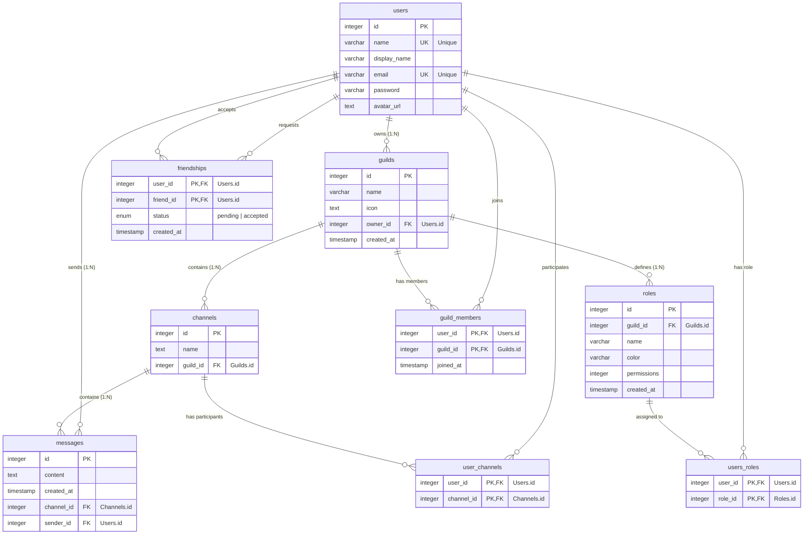

*This project was created by smatsuo, kakawamo, hirosuzu, and tkitahar as part of the 42 curriculum.*

# Description

ft_transcendence is a Web application created as the final project of the 42 curriculum.
The main objective of this project is to build a Web application that can be accessed by multiple users simultaneously.

## Main Features
- **Chat Functionality**: You can converse with other users in real-time through guilds and DMs.
- **User Profile**: Avatars, nicknames, etc. are displayed.
- **3D Model Generation**: Generate 3D models using Meshy and send them to other users.

# Instructions

## Prerequisites
The following tools must be installed:
- Docker Compose

## Environment Setup and Execution

1. Clone the repository:
```bash
git clone <url> --recursive
```

2. Update submodules:
```bash
git submodule update --init --recursive
```

3. Copy `.env.example` and set the required environment variables in `.env`.

4. (optional) Rewrite `/etc/hosts` to bind `127.0.0.1` with the domains specified in `WEBAPP_HOST`, `STORAGE_HOST`, and `KIBANA_HOST`:
```bash
127.0.0.1   <hostname specified in WEBAPP_HOST> <hostname specified in STORAGE_HOST> <hostname specified in KIBANA_HOST>
```

5. Run the application:

For Development:
```bash
docker compose up
```

For Production:
```bash
docker compose -f compose.prod.yml up
```

6. Accessing Services:

| Service | Development URL | Production URL |
| --- | --- | --- |
| Web Application | http://localhost:5173 | `https://${HOST}` |
| MinIO Console | http://localhost:9001 | `https://${HOST}:${STORAGE_PORT}` |
| Kibana | http://localhost:5601 | `https://${HOST}:${KIBANA_PORT}` |

Login to Kibana:
- Username: `elastic`
- Password: The value set in `ELASTIC_PASSWORD` in the `.env` file.

# Resources

The following official documentation and articles were referenced in the development of this project.

## References
- [React Router v7 Documentation](https://reactrouter.com/)
- [Mantine UI Documentation](https://mantine.dev/)
- [Drizzle ORM Documentation](https://orm.drizzle.team/)
- [Tailwind CSS v4 Documentation](https://tailwindcss.com/)
- [Hono Documentation](https://hono.dev/)

## Use of AI
In the development process, GitHub Copilot and Gemini were used to assist with code generation, debugging, refactoring, and documentation. They were particularly utilized for the initial implementation of complex components and accelerating error resolution.

# Team Information

| Member | Role | Responsibilities |
| --- | --- | --- |
| smatsuo | Tech Lead | Technology Selection / Design / Review / Feature Development |
| kakawamo | Developer | Feature Development |
| hirosuzu | PO | Requirements Definition / 3D Modeling / UI Design |
| tkitahar | PM | Project Management / Legal Affairs |

# Project Management

## Development Flow
Tasks were managed using GitHub Issues and Projects. The specific flow is as follows:

1. **Issue Creation**: Add issues to the backlog.
2. **Requirements Definition**: Align with PO, PM, and Tech Lead, then move to Planning.
3. **Design**: Describe UI images and implementation policies in the Issue.
4. **Implementation**: Assign an implementer and move to In progress.
5. **Review**: Create a PR and conduct code review (Copilot review -> Team review).
6. **Merge**: After approval, merge into the main branch.

## Tools Used
- **Task Management**: GitHub Projects / Issues
- **Communication**: Discord

# Technical Stack

## Frontend
- **Framework**: React Router v7
- **Library**: React 19
- **UI Framework**: Mantine UI, Tailwind CSS

## Backend
- **Runtime**: Bun
- **Framework**: Hono (via react-router-hono-server)
- **ORM**: Drizzle ORM
- **Inmemory DB**: Redis

## Database
- **PostgreSQL**: Because it is a high-performance and highly scalable OSS.

## Infrastructure & DevOps
- **Containerization**: Docker, Docker Compose
- **Object Storage**: MinIO
- **Logging/Monitoring**: Elastic Stack (Elasticsearch, Logstash, Kibana)
- **Linting/Formatting**: Biome

## Justification
- **React Router v7**: To seamlessly integrate between backend and frontend.
- **Mantine UI**: To improve development efficiency with high-quality and accessible components.
- **Drizzle ORM**: To balance type safety with SQL-like operability, and for excellent performance.
- **Bun**: To improve the development experience and execution performance with a fast runtime and rich API.

# Database Schema

For details on the database schema, please refer to the `db/schema` directory in the codebase.
The main table structure is as follows:

- **users**: User information management
- **user_channels**: Association between users and channels
- **messages**: Chat messages



# Features List

1. **User Profile**
   - View and edit user information
   - Avatar image upload (using MinIO)

2. **Chat**
   - Real-time DM (Direct Message)
   - Channel creation and management
   - User invitation and block functions

3. **Friend System**
   - Add/remove friends
   - List friends

# Modules
Total Points Earned: **19** (Major: 8 * 2pts, Minor: 3 * 1pt)

## Major Modules (2pts each)

### Use a framework for both the frontend and backend.
- **Points**: 2pts
- **Justification**: To learn modern web development best practices and enhance development efficiency and maintainability. It was judged essential for building valid and scalable applications.
- **Implementation**: Adopted **React Router v7** for the frontend and **Hono** for the backend. These provide type safety with TypeScript and high performance.
- **Members**: smatsuo

### Implement real-time features using WebSockets or similar technology.
- **Points**: 2pts
- **Justification**: To realize immediate interaction without delay between users in chat and gameplay, improving UX.
- **Implementation**: Implemented real-time communication using the WebSocket protocol, with Hono's WebSocket helper on the server side and React hooks on the client side.
- **Members**: smatsuo

### Allow users to interact with other users.
- **Points**: 2pts
- **Justification**: To provide basic value as a social platform and increase user engagement.
- **Implementation**: Implemented friend request/approval flow, block function, and user status (online/offline/in-game) display function.
- **Members**: smatsuo, kakawamo

### Standard user management and authentication.
- **Points**: 2pts
- **Justification**: To provide a rich chat experience.
- **Implementation**: Implemented a function to determine if a user is online by keeping the connection alive while the tab is open using Websocket. Also implemented a function to save avatars using MinIO and display images.
- **Members**: smatsuo

### Advanced permissions system.
- **Points**: 2pts
- **Justification**: To perform appropriate access control (security) according to roles within channels and organizations.
- **Implementation**: Introduced Role-Based Access Control (RBAC) to restrict API endpoints and UI component operations according to authority levels such as Administrator, Member, and Owner.
- **Members**: kakawamo

### An organization system.
- **Points**: 2pts
- **Justification**: To promote community formation and enable activities and competition in groups.
- **Implementation**: Implemented as a "Guild" system. Users can create and join organizations and use features like organization-specific chat.
- **Members**: kakawamo

### Implement advanced 3D graphics using a library like Three.js or Babylon.js.
- **Points**: 2pts
- **Justification**: To provide a visually rich experience and express beyond the constraints of normal Web applications.
- **Implementation**: Used **Three.js** (React Three Fiber) to realize 3D model rendering and interaction on the Web browser. Also supports display of models generated by Meshy API.
- **Members**: hirosuzu

### Infrastructure for log management using ELK (Elasticsearch, Logstash, Kibana).
- **Points**: 2pts
- **Justification**: To build a log management infrastructure equivalent to a production environment, facilitating troubleshooting and usage analysis.
- **Implementation**: Launched Elasticsearch, Logstash, and Kibana as Docker containers, and built a pipeline to collect and index application logs via Logstash and visualize them on the Kibana dashboard.
- **Members**: smatsuo

## Minor Modules (1pt each)

### Use an ORM for the database.
- **Points**: 1pt
- **Justification**: To prevent errors and security risks (injection attacks) from writing raw SQL, and to improve development efficiency.
- **Implementation**: Using **Drizzle ORM** for type-safe schema definition and query construction.
- **Members**: smatsuo

### Server-Side Rendering (SSR) for improved performance and SEO.
- **Points**: 1pt
- **Justification**: To improve Initial Display Speed (FCP) and enhance UX.
- **Implementation**: Leveraging React Router v7's SSR function to pre-render HTML on the server side and deliver it to the client.
- **Members**: smatsuo

### Support for additional browsers.
- **Points**: 1pt
- **Justification**: To provide an environment where more users can use it comfortably without depending on a specific browser.
- **Implementation**: Implemented in compliance with standard Web technologies, and verified operation and compatibility on major browsers such as Firefox and Safari in addition to Chrome.
- **Members**: smatsuo


# Individual Contributions

The roles and specific contributions of each member are as follows:

## smatsuo (Tech Lead)
- **Role**: Technology selection, architecture design, code review, implementation of major features
- **Modules**:
  - **Framework**: Introduction and foundation building of React Router v7 (Frontend) and Hono (Backend)
  - **Real-time features**: Implementation of real-time communication using WebSocket
  - **User Management**: Online status determination, avatar image saving/displaying using MinIO, authentication implementation
  - **Infrastructure**: Construction of log management infrastructure using ELK stack
  - **Database**: Drizzle ORM introduction and schema management
  - **Web**: SSR implementation, cross-browser support, etc.
  - **Interaction**: Implementation of user interactions such as friend functions and block functions (collaborated with kakawamo)

## kakawamo (Developer)
- **Role**: Backend and frontend feature development
- **Modules**:
  - **Permissions**: Implementation of Role-Based Access Control (RBAC)
  - **Organization**: Design and implementation of the guild system
  - **Interaction**: Implementation of user interaction functions (collaborated with smatsuo)

## hirosuzu (PO)
- **Role**: Product Owner, Requirements Definition, UI/UX Design, 3D feature implementation
- **Modules**:
  - **Graphics**: Implementation of 3D model generation and display functions using Three.js and Meshy API
  - **Design**: UI design of the entire application and user experience design

## tkitahar (PM)
- **Role**: Project Manager, Progress Management, Legal response
- **Modules/Tasks**:
  - **Legal**: Creation of Terms of Service and Privacy Policy
  - **Management**: Schedule management and progress adjustment of the entire project